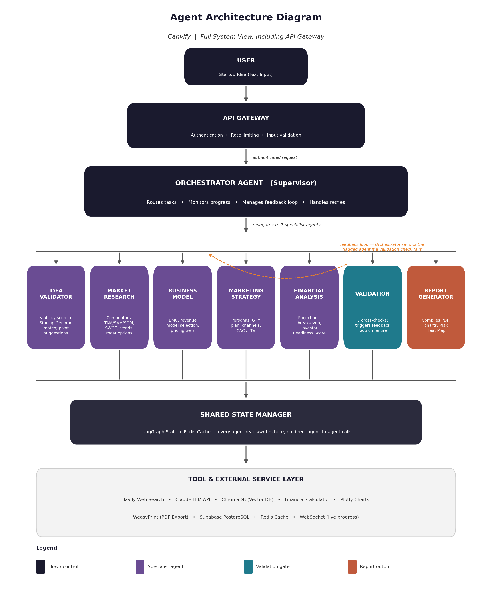
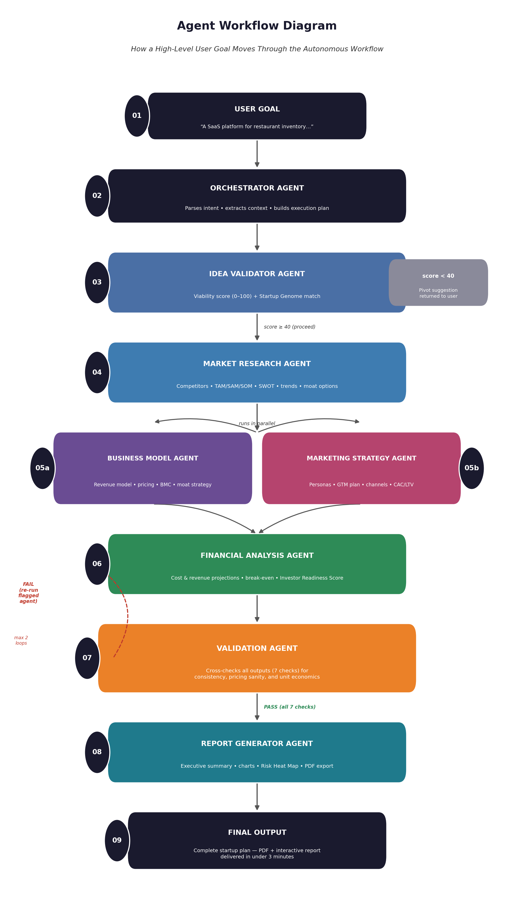

<div align="center">

# Canvify

### An Autonomous Multi-Agent AI Startup Co-Founder

**CodeSplash '26 — Agentic AI Phase** · Theme 02: AI Startup Co-Founder

[](./LICENSE)
[](https://www.python.org/)
[](https://nextjs.org/)
[](https://langchain-ai.github.io/langgraph/)

</div>

---

## What Is Canvify?

Canvify turns a single sentence describing a startup idea into a complete,
investor-ready startup plan — autonomously. Submit an idea, and eight
specialized AI agents independently validate it, research the live market,
design a business model, project three years of financials, build a
go-to-market strategy, cross-check every output against every other output
for consistency, and deliver a polished report. No step-by-step instruction
required, no human research in between — typically under three minutes.

Built for the [CodeSplash '26 Agentic AI Phase](.), Theme 02: AI Startup Co-Founder.

---

## Table of Contents

- [The Problem](#the-problem)
- [Architecture](#architecture)
- [How It Works — End-to-End Flow](#how-it-works--end-to-end-flow)
- [Key Innovations](#key-innovations)
- [Tech Stack](#tech-stack)
- [Project Structure](#project-structure)
- [Getting Started](#getting-started)
- [API Usage](#api-usage)
- [Testing](#testing)
- [Deployment](#deployment)
- [Branching & Contributing](#branching--contributing)
- [Safety & Responsible AI](#safety--responsible-ai)
- [Roadmap](#roadmap)
- [Team](#team)
- [License](#license)

---

## The Problem

Turning a raw startup idea into a validated, fundable plan takes weeks of
fragmented manual effort — market research, competitor analysis, business
modeling, financial projections, go-to-market planning — usually without a
co-founder who has all four of those skills at once. CB Insights' analysis
of hundreds of startup post-mortems found that roughly 42% of failed
startups cited "no market need" as a primary cause of failure, ahead of
running out of cash or having the wrong team — a problem that rigorous,
early validation could catch, if founders had the time and expertise to
do it properly before building.

Canvify is that co-founder.

---

## Architecture

Canvify is a multi-agent system: one Orchestrator (supervisor) and seven
specialist agents, all communicating through a single shared state object —
no agent ever calls another agent directly. An API Gateway sits in front of
the Orchestrator, handling authentication, rate limiting, and input
validation before any agent runs.



| Layer | Component | Responsibility |
|---|---|---|
| Entry | **API Gateway** | Auth, rate limiting, input validation |
| Control | **Orchestrator Agent** | Routes tasks, monitors progress, manages the feedback loop, handles retries |
| Agents | **7 specialist agents** | Idea Validator, Market Research, Business Model, Marketing Strategy, Financial Analysis, Validation, Report Generator |
| State | **Shared State Manager** | LangGraph state + Redis cache — the only channel agents communicate through |
| Tools | **Tool & External Service Layer** | Tavily, Claude API, ChromaDB, financial calculator, Plotly, WeasyPrint, Supabase, WebSocket |

Full breakdown of every agent's inputs/actions/outputs is in
[`docs/architecture.md`](docs/architecture.md).

---

## How It Works — End-to-End Flow

This is the same pipeline shown above, but as a **sequence** — how one
startup idea actually moves through all nine stages, start to finish.



| # | Stage | What happens |
|---|---|---|
| 01 | **User goal** | User submits a startup idea as plain text |
| 02 | **Orchestrator** | Parses intent, extracts context, builds the execution plan |
| 03 | **Idea Validator** | Scores viability 0–100 using web search + Startup Genome Matching (ChromaDB). Score < 40 → returns pivot suggestions instead of proceeding |
| 04 | **Market Research** | Live web search for competitors, TAM/SAM/SOM sizing, SWOT, trends, competitive moat options |
| 05a / 05b | **Business Model + Marketing Strategy** *(run in parallel)* | Business model, pricing, and Business Model Canvas on one branch; customer personas, channels, and CAC/LTV on the other — neither depends on the other, so they execute simultaneously |
| 06 | **Financial Analysis** | 3-year revenue/cost projections, break-even, funding needs, Investor Readiness Score |
| 07 | **Validation** | Runs 7 independent consistency checks across every upstream output. **On failure**, the Orchestrator re-runs only the specific flagged agent (capped at 2 feedback-loop rounds) — this is the system correcting itself with no human involvement |
| 08 | **Report Generator** | Only runs after Validation passes. Builds the executive summary, charts, Risk Heat Map, Investor Readiness Scorecard |
| 09 | **Final output** | Complete startup plan delivered as PDF + interactive report |

The dashed red arrow in the diagram is the feedback loop from step 7 — the
single most important autonomous behavior in the system: Canvify catches
its own inconsistent or unrealistic outputs and fixes them before a human
ever sees them.

---

## Key Innovations

1. **Startup Genome Matching** — new ideas are compared against a vector
   database of real startup outcomes (ChromaDB) before deep research even
   begins, producing a data-driven viability signal rather than a purely
   opinion-based LLM judgment.
2. **Dynamic Pivot Engine** — a low viability score doesn't just reject the
   idea; it autonomously proposes concrete pivot directions.
3. **Self-correcting Validation Loop** — 7 cross-checks + an autonomous
   feedback loop that re-runs only the specific agent at fault.
4. **Investor Readiness Score** — a transparent, 5-category score (market
   size, unit economics, scalability, moat, team feasibility).
5. **Risk Heat Map** — a likelihood-vs-impact grid across market, technical,
   financial, competitive, and operational risk categories.

---

## Tech Stack

| Category | Technology |
|---|---|
| LLM | Claude (Anthropic API) |
| Agent Framework | LangGraph |
| Backend | Python 3.12, FastAPI |
| Frontend | Next.js 14, TypeScript, Tailwind CSS |
| Search | Tavily API |
| Vector DB | ChromaDB |
| Database | PostgreSQL (Supabase) |
| Cache | Redis |
| Charts / PDF | Plotly, WeasyPrint |
| CI/CD | GitHub Actions |
| Hosting | Vercel (frontend), Railway (backend) |

---

## Project Structure

```
canvify/
├── backend/
│   ├── agents/        # All 8 agents (orchestrator + 7 specialists)
│   ├── tools/          # Tavily, Claude, ChromaDB, financial calc, PDF, charts
│   ├── graph/          # LangGraph state, workflow, routing
│   ├── api/             # API Gateway, REST routes, WebSocket
│   └── db/              # Supabase + Redis clients
├── frontend/
│   ├── app/              # Idea input, dashboard, report viewer pages
│   ├── components/       # Progress tracker, charts, Risk Heat Map, score card
│   └── lib/               # API + WebSocket clients
├── data/startup_genome/  # Seed data for genome matching
├── tests/                  # One test file per agent + e2e pipeline test
├── docs/                    # Architecture, API reference, deployment docs
└── .github/workflows/       # CI/CD pipeline
```

Full annotated structure: [`docs/architecture.md`](docs/architecture.md).

---

## Getting Started

### Prerequisites
- Python 3.12+
- Node.js 20+
- API keys: [Anthropic](https://console.anthropic.com), [Tavily](https://tavily.com)

### Setup

```bash
git clone <this-repo-url>
cd canvify
bash scripts/setup_dev.sh
```

Then, in two separate terminals:

```bash
# Terminal 1 — backend
cd backend
cp .env.example .env   # fill in your API keys
uvicorn main:app --reload

# Terminal 2 — frontend
cd frontend
cp .env.local.example .env.local
npm run dev
```

Visit `http://localhost:3000`. Backend health check: `http://localhost:8000/health`.

### Or with Docker

```bash
docker-compose up
```

---

## API Usage

```bash
curl -X POST "http://localhost:8000/analyze" \
  -H "Content-Type: application/json" \
  -d '{"idea": "A SaaS platform for restaurant inventory management using AI demand prediction"}'
```

Returns the full pipeline result as JSON once all 8 agents complete. Live
per-agent progress is available over WebSocket at `ws://localhost:8000/ws`.
Full endpoint reference: [`docs/api-reference.md`](docs/api-reference.md).

---

## Testing

```bash
pytest tests/
```

Each agent has a dedicated unit test (`tests/test_<agent>.py`) plus a full
pipeline integration test (`tests/test_e2e.py`) that runs multiple
structurally different sample ideas end-to-end and verifies the validation
feedback loop actually triggers and resolves on an injected inconsistency.

---

## Deployment

Frontend deploys to **Vercel**, backend to **Railway**, both auto-deploying
on push via GitHub Actions. Full pipeline details in
[`docs/deployment.md`](docs/deployment.md).

---

## Branching & Contributing

This repo follows a `main` → `dev` → `feature/*` branching model, with one
branch per agent/component. **Before contributing, read
[`docs/branching-strategy.md`](docs/branching-strategy.md)** — in
particular, the shared state schema (`backend/graph/state.py`) must be
finalized on `dev` before any agent-specific branch is created, to avoid
merge conflicts across the team.

---

## Safety & Responsible AI

- All user input is length-checked, sanitized, and screened before any
  agent runs (API Gateway).
- Every financial projection is self-checked for reasonableness, then
  independently re-checked by the Validation Agent.
- The feedback loop is hard-capped at 2 rounds — the system cannot loop
  indefinitely.
- Every agent action is logged with a timestamp and token count for a full
  audit trail.
- All output is explicitly labeled as an estimate for human review, not
  financial advice.

Full detail in the project proposal, Section 10.

---

## Roadmap

- Pitch Deck Generator Agent
- Legal Advisor Agent (business structure, regulatory flags)
- Continuous Monitoring Agent (re-run market research post-delivery, alert on major shifts)
- Crunchbase / Google Trends integrations
- Path to Level 04 full autonomy

---

## Team

| Role | Name |
|---|---|
| Team Lead | *[Your Name]* |
| Backend / Agents | *[Team Member]* |
| Frontend | *[Team Member]* |
| DevOps / Integration | *[Team Member]* |

**University:** *[Your University Name]*

---

## License

Distributed under the MIT License. See [`LICENSE`](LICENSE) for details.

<div align="center">

Built for CodeSplash '26, Computer Science Students' Association, University of Kelaniya.

</div>